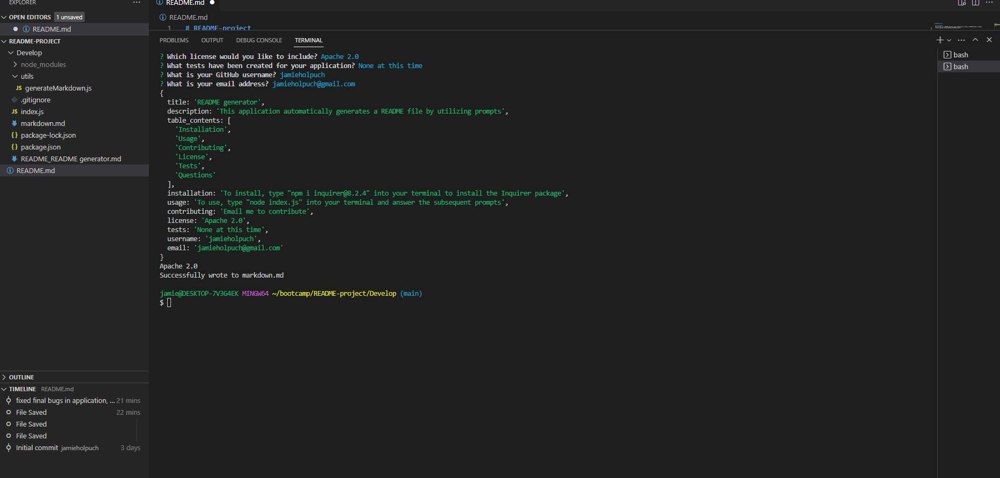
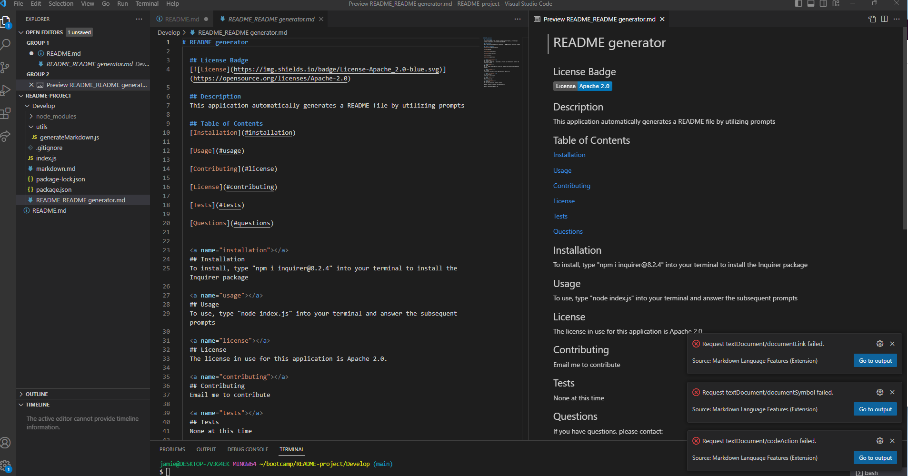

# README-project

  ## Description
  This project is a README generator that automatically creates a README based on prompts. 
  <https://github.com/jamieholpuch/README-project>

  
  
  
  
  ## Installation 
  To install, type "npm i" and install the packages into your terminal. 
  
  ## Usage
  Type node index.js in your terminal and answer the subsequent prompts. A README file will be generated once you complete the prompts. 

  Demo Video: <https://drive.google.com/file/d/1xSaVdpcOB31nOt2i6ylyGfLuHuCyX8Xy/view>
  
  ## Contributing
  To contribute to this project, contact me via email. 
  
  ## Questions 
  If you have questions, please contact:
  
  GitHub: <https:////github.com/jamieholpuch>
  
  Email: jamieholpuch@gmail.com